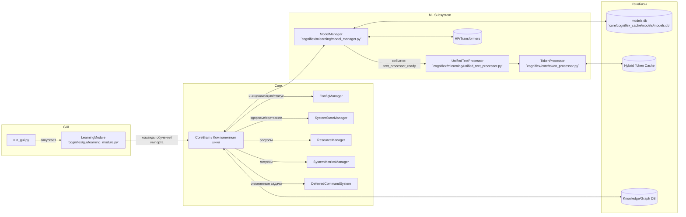

# Архитектура CogniFlex

Ниже приведена обзорная архитектурная схема и краткое описание ключевых компонентов системы.

## Диаграмма (Mermaid)

## Ключевые компоненты
- __GUI / LearningModule__ (`cogniflex/gui/learning_module.py`)
  - Кнопка «Обучить модель» запускает `memory_graph_trainer.train_async()` напрямую или через `DeferredCommandSystem`.
  - Мониторинг статуса обучения, отображение метрик тренера (`get_training_stats()`).

- __Core менеджеры__
  - `ConfigManager`, `SystemStateManager`, `ResourceManager`, `SystemMetricsManager` — разделённые обязанности после рефакторинга из `core_brain.py`.
  - Публичные методы ядра: `get_system_health()`, `get_system_metrics()`, `get_system_dashboard_data()`.

- __ModelManager__ (`cogniflex/mlearning/model_manager.py`)
  - Реестр моделей, SQLite БД (`models.db`), приоритеты/автозагрузка, __offline__ режим (env: `TRANSFORMERS_OFFLINE`, `HF_HUB_OFFLINE`).
  - Флаг `autoload` управляет фоновыми службами.

- __UnifiedTextProcessor__ (`cogniflex/mlearning/unified_text_processor.py`)
  - Единая точка работы с токенизаторами/моделями; интеграция с `TokenProcessor`.

- __TokenProcessor__ (`cogniflex/core/token_processor.py`)
  - Асинхронная токенизация + гибридный кэш, существенный прирост производительности.

- __Хранилища__
  - `models.db`, гибридный токен‑кэш, БД графа знаний.

## Потоки и фоновые службы
- Фоновые загрузки моделей в `ModelManager` (управляются приоритетом и `autoload`).
- Отложенные команды запуска обучения через `DeferredCommandSystem` (без блокировки GUI).

## Надёжность и офлайн
- Все вызовы `from_pretrained()` учитывают офлайн‑режим (`local_files_only=True` при активных env переменных).
- Ошибки инициализации «мягко» деградируют, доступна частичная работоспособность.

## Модели: дефолт, загрузка, fallback и hot‑swap

- **Дефолтная модель**
  - Алиас `default_text_gen` указывает на `Qwen/Qwen2.5-7B-Instruct`, тип `qwen`, приоритет 100, теги: `default,qwen,multilingual,russian,instruct`.
  - Миграция/выравнивание алиаса выполняется в `ModelManager._migrate_default_models()` и резервно в `_add_default_models()`.
  - Метаданные и БД: `core/cogniflex_cache/models/models.db`.

- **Загрузка и приоритеты**
  - Реестр и выборка моделей: `ModelManager.get_available_models(domain=None, min_priority=0)` возвращает `List[ModelMetadata]`, отсортированный по приоритету (по убыванию).
  - Фоновая загрузка невыполненных моделей по приоритету: `ModelManager._load_pending_models()`; число параллельных загрузок ограничено `max_workers`.
  - Получение модели для задачи: `ModelManager.get_model_for_task(task)` возвращает `(model, tokenizer, model_name)`.

- **Fallback генерации**
  - В `ResponseGenerator.generate_response()` при ошибке кодирования/генерации срабатывает безопасный ответ через `_fallback_generation()`; результаты кэшируются гибридным кэшем.
  - Санитизация и контроль качества текста: `_clean_text()`, `_is_text_corrupted()`.

- **Горячая замена (hot‑swap) / отказоустойчивость**
  - Поддерживается выбор «лучшей» доступной модели по приоритету/здоровью (селектор внутри `ModelManager.get_model_for_task()` и мониторинг загрузок/статусов моделей).
  - При недоступности/ошибках активной модели генерация не падает: используется fallback‑ответ, а менеджер продолжает фоновые попытки загрузки альтернатив (см. `_load_model_internal()`, статистика/состояния в `ModelInstance.health`).
  - Список доступных моделей для GUI/клиентов: `CoreBrain.get_available_models()` делегирует в `MLUnit.get_available_models()` либо напрямую в `ModelManager.get_available_models()`.

Примечание: офлайн‑режим управляется `TRANSFORMERS_OFFLINE` и `HF_HUB_OFFLINE`. В таком режиме загрузка весов выполняется только из локального кэша/директорий.
